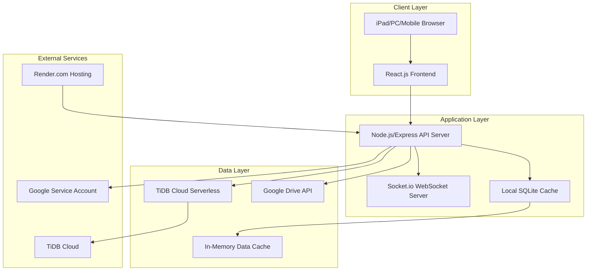
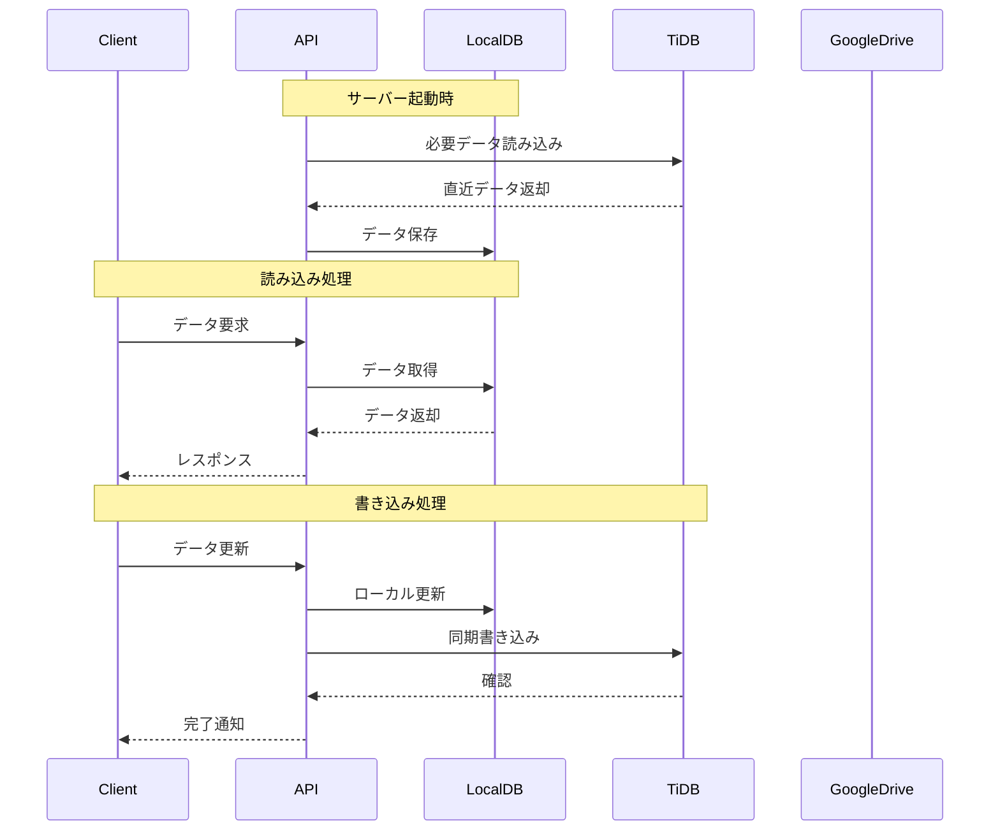

# ScaenaHub v2 設計書

## 概要

ScaenaHub v2は、既存のScaenaHubをベースに、データベースをTiDB Cloud Serverlessに移行し、Discord風の高度なコミュニケーション機能を追加したWebアプリケーションです。完全無料での運用を前提とし、iPad・PC・スマホ対応のレスポンシブデザインで、効率的なチーム内コミュニケーションを実現します。

## アーキテクチャ

### システム全体構成



### データフロー設計



### 技術スタック

- **フロントエンド**: React.js 18 + TypeScript + Tailwind CSS + Vite
- **バックエンド**: Node.js 22 + Express.js + TypeScript
- **リアルタイム通信**: Socket.io
- **メインデータベース**: TiDB Cloud Serverless (MySQL互換、無料プラン)
- **ローカルキャッシュ**: SQLite3 + better-sqlite3
- **認証**: JWT + bcrypt
- **ファイルストレージ**: Google Drive API v3
- **デプロイ**: Render.com (無料プラン)

## コンポーネントとインターフェース

### フロントエンド コンポーネント構成

```
src/
├── components/
│   ├── auth/
│   │   ├── LoginForm.tsx
│   │   ├── RegisterForm.tsx
│   │   └── ProfileSettings.tsx
│   ├── user/
│   │   ├── UserProfile.tsx
│   │   ├── StatusSelector.tsx
│   │   ├── AvatarUpload.tsx
│   │   └── CustomStatus.tsx
│   ├── chat/
│   │   ├── ChannelList.tsx
│   │   ├── MessageList.tsx
│   │   ├── MessageInput.tsx
│   │   ├── ThreadView.tsx
│   │   ├── ReactionPicker.tsx
│   │   ├── MessageSearch.tsx
│   │   └── PinnedMessages.tsx
│   ├── channels/
│   │   ├── TextChannel.tsx
│   │   ├── AnnouncementChannel.tsx
│   │   ├── DiscussionChannel.tsx
│   │   └── ChannelSettings.tsx
│   ├── script/
│   │   ├── ScriptViewer.tsx
│   │   ├── ScriptEditor.tsx
│   │   ├── ScriptTable.tsx
│   │   ├── ScriptCell.tsx
│   │   ├── ScriptToolbar.tsx
│   │   ├── ScriptPermissions.tsx
│   │   └── ScriptHistory.tsx
│   ├── admin/
│   │   ├── AdminDashboard.tsx
│   │   ├── UserManagement.tsx
│   │   ├── RoleManagement.tsx
│   │   ├── ChannelManagement.tsx
│   │   ├── ModerationSettings.tsx
│   │   └── SystemMonitoring.tsx
│   └── common/
│       ├── Layout.tsx
│       ├── Navigation.tsx
│       ├── FileUpload.tsx
│       ├── MarkdownRenderer.tsx
│       └── LinkPreview.tsx
├── hooks/
│   ├── useSocket.ts
│   ├── useAuth.ts
│   ├── useProfile.ts
│   ├── useChannels.ts
│   ├── useMessages.ts
│   └── useScript.ts
├── services/
│   ├── api.ts
│   ├── socket.ts
│   ├── auth.ts
│   └── fileUpload.ts
└── types/
    ├── user.ts
    ├── message.ts
    ├── channel.ts
    ├── role.ts
    └── script.ts
```

### バックエンド API 構成

```
src/
├── routes/
│   ├── auth.ts          # 認証関連API
│   ├── users.ts         # ユーザー・プロフィール管理API
│   ├── channels.ts      # チャンネル管理API
│   ├── messages.ts      # メッセージ管理API
│   ├── files.ts         # ファイル管理API
│   ├── roles.ts         # ロール・権限管理API
│   ├── scripts.ts       # 脚本管理API
│   ├── moderation.ts    # モデレーション機能API
│   └── admin.ts         # 管理者ダッシュボードAPI
├── services/
│   ├── database/
│   │   ├── tidb.ts      # TiDB接続サービス
│   │   ├── sqlite.ts    # SQLiteローカルキャッシュ
│   │   └── sync.ts      # データ同期サービス
│   ├── googleDrive.ts   # Google Drive API
│   ├── auth.ts          # 認証サービス
│   ├── cache.ts         # メモリキャッシュ管理
│   └── monitoring.ts    # リソース監視サービス
├── middleware/
│   ├── auth.ts          # 認証ミドルウェア
│   ├── roles.ts         # ロール権限チェック
│   ├── rateLimit.ts     # レート制限
│   └── validation.ts    # リクエスト検証
├── models/
│   ├── User.ts
│   ├── Channel.ts
│   ├── Message.ts
│   ├── Role.ts
│   ├── Script.ts
│   └── UserProfile.ts
└── socket/
    ├── handlers/
    │   ├── message.ts
    │   ├── channel.ts
    │   ├── presence.ts   # オンラインステータス
    │   └── notification.ts
    └── middleware/
        └── auth.ts
```

### 主要API エンドポイント

#### 認証・ユーザー管理API
- `POST /api/auth/login` - ログイン
- `POST /api/auth/register` - ユーザー登録（登録キー必須）
- `POST /api/auth/logout` - ログアウト
- `GET /api/users/profile` - プロフィール取得
- `PUT /api/users/profile` - プロフィール更新
- `PUT /api/users/status` - オンラインステータス更新
- `PUT /api/users/custom-status` - カスタムステータス設定

#### チャンネル・メッセージAPI
- `GET /api/channels` - チャンネル一覧取得
- `POST /api/channels` - チャンネル作成
- `PUT /api/channels/:id` - チャンネル設定更新
- `DELETE /api/channels/:id` - チャンネル削除
- `GET /api/channels/:id/messages` - メッセージ一覧取得
- `POST /api/channels/:id/messages` - メッセージ投稿
- `PUT /api/messages/:id` - メッセージ編集
- `DELETE /api/messages/:id` - メッセージ削除
- `POST /api/messages/:id/reactions` - リアクション追加
- `POST /api/messages/:id/pin` - メッセージピン留め
- `GET /api/messages/search` - メッセージ検索

#### ロール・権限管理API
- `GET /api/roles` - ロール一覧取得
- `POST /api/roles` - ロール作成
- `PUT /api/roles/:id` - ロール更新
- `DELETE /api/roles/:id` - ロール削除
- `PUT /api/users/:id/roles` - ユーザーロール割り当て
- `PUT /api/channels/:id/permissions` - チャンネル権限設定

#### 脚本管理API
- `GET /api/scripts` - 脚本一覧取得
- `POST /api/scripts` - 脚本作成
- `GET /api/scripts/:id` - 脚本詳細取得
- `PUT /api/scripts/:id` - 脚本設定更新
- `DELETE /api/scripts/:id` - 脚本削除
- `GET /api/scripts/:id/lines` - 脚本行一覧取得
- `POST /api/scripts/:id/lines` - 脚本行追加
- `PUT /api/scripts/:id/lines/:lineNumber` - 脚本行更新
- `DELETE /api/scripts/:id/lines/:lineNumber` - 脚本行削除
- `PUT /api/scripts/:id/permissions` - 脚本権限設定
- `GET /api/scripts/:id/history` - 脚本編集履歴取得

#### 管理者API
- `GET /api/admin/dashboard` - ダッシュボード情報
- `GET /api/admin/users` - ユーザー管理一覧
- `PUT /api/admin/users/:id/ban` - ユーザーBAN
- `PUT /api/admin/users/:id/kick` - ユーザーキック
- `GET /api/admin/moderation` - モデレーション設定
- `PUT /api/admin/moderation` - モデレーション設定更新
- `GET /api/admin/system-status` - システム状態監視

## データモデル

### User Model (拡張)
```typescript
interface User {
  id: string;
  username: string;
  email?: string;
  passwordHash: string;
  roles: string[]; // 複数ロール対応
  profile: UserProfile;
  isActive: boolean;
  isBanned: boolean;
  lastSeen: Date;
  createdAt: Date;
  updatedAt: Date;
}

interface UserProfile {
  displayName: string;
  avatar?: string;
  bio?: string; // 自己紹介文
  onlineStatus: 'online' | 'away' | 'busy' | 'offline';
  customStatus?: {
    text: string;
    emoji?: string;
    expiresAt?: Date;
  };
}
```

### Channel Model (拡張)
```typescript
interface Channel {
  id: string;
  name: string;
  description?: string;
  type: 'text' | 'announcement' | 'discussion';
  categoryId?: string;
  isPrivate: boolean;
  allowedRoles: string[];
  allowedUsers: string[];
  settings: ChannelSettings;
  createdBy: string;
  createdAt: Date;
  updatedAt: Date;
}

interface ChannelSettings {
  slowMode?: number; // 秒単位
  requireApproval?: boolean; // アナウンスチャンネル用
  autoArchive?: boolean; // ディスカッションチャンネル用
  maxThreads?: number;
}

interface Category {
  id: string;
  name: string;
  position: number;
  channels: string[];
}
```

### Message Model (拡張)
```typescript
interface Message {
  id: string;
  channelId: string;
  userId: string;
  content: string;
  type: 'text' | 'file' | 'system' | 'announcement';
  threadId?: string;
  parentMessageId?: string;
  mentions: Mention[];
  reactions: Reaction[];
  attachments: Attachment[];
  embeds: Embed[]; // リンクプレビュー用
  isPinned: boolean;
  isEdited: boolean;
  editedAt?: Date;
  createdAt: Date;
}

interface Mention {
  type: 'user' | 'role' | 'channel';
  id: string;
  name: string;
}

interface Embed {
  type: 'link' | 'image' | 'video';
  url: string;
  title?: string;
  description?: string;
  thumbnail?: string;
}
```

### Role Model (拡張)
```typescript
interface Role {
  id: string;
  name: string;
  color: string; // HEX色コード
  position: number; // 階層順序
  permissions: RolePermissions;
  isDefault: boolean;
  mentionable: boolean;
  createdAt: Date;
  updatedAt: Date;
}

interface RolePermissions {
  // サーバー管理
  manageServer: boolean;
  manageChannels: boolean;
  manageRoles: boolean;
  manageUsers: boolean;
  
  // チャンネル権限
  viewChannels: boolean;
  sendMessages: boolean;
  sendFiles: boolean;
  embedLinks: boolean;
  mentionEveryone: boolean;
  
  // メッセージ管理
  manageMessages: boolean;
  pinMessages: boolean;
  readMessageHistory: boolean;
  
  // モデレーション
  kickMembers: boolean;
  banMembers: boolean;
  moderateMessages: boolean;
}
```

### Script Model (脚本管理)
```typescript
interface ScriptLine {
  id: string;
  scriptId: string;
  lineNumber: number;
  character: string; // 登場人物名
  dialogue: string; // 台詞（動き等）- 台詞は黒字、動きは青字で表示
  lighting: string; // 照明
  audioVideo: string; // 音響と映像
  notes: string; // 備考
  formatting: ScriptFormatting; // 書式設定
  createdAt: Date;
  updatedAt: Date;
  lastEditedBy: string;
}

interface Script {
  id: string;
  title: string;
  description?: string;
  isActive: boolean; // アクティブな脚本（複数脚本対応）
  permissions: ScriptPermissions;
  createdBy: string;
  createdAt: Date;
  updatedAt: Date;
}

interface ScriptFormatting {
  bold: boolean;
  underline: boolean;
  italic: boolean;
  color?: string; // 台詞（黒）、動き（青）の色指定
}

interface ScriptPermissions {
  viewRoles: string[]; // 閲覧可能ロール
  editRoles: string[]; // 編集可能ロール
  viewUsers: string[]; // 閲覧可能ユーザー
  editUsers: string[]; // 編集可能ユーザー
}
```

### データベース設計（TiDB/MySQL互換）

```sql
-- Scripts table
CREATE TABLE scripts (
  id VARCHAR(36) PRIMARY KEY,
  title VARCHAR(200) NOT NULL,
  description TEXT,
  is_active BOOLEAN DEFAULT TRUE,
  permissions JSON DEFAULT '{"viewRoles": [], "editRoles": [], "viewUsers": [], "editUsers": []}',
  created_by VARCHAR(36) NOT NULL,
  created_at TIMESTAMP DEFAULT CURRENT_TIMESTAMP,
  updated_at TIMESTAMP DEFAULT CURRENT_TIMESTAMP ON UPDATE CURRENT_TIMESTAMP,
  FOREIGN KEY (created_by) REFERENCES users(id),
  INDEX idx_active (is_active),
  INDEX idx_created_by (created_by)
);

-- Script lines table
CREATE TABLE script_lines (
  id VARCHAR(36) PRIMARY KEY,
  script_id VARCHAR(36) NOT NULL,
  line_number INT NOT NULL,
  character_name VARCHAR(100) DEFAULT '',
  dialogue TEXT DEFAULT '',
  lighting TEXT DEFAULT '',
  audio_video TEXT DEFAULT '',
  notes TEXT DEFAULT '',
  formatting JSON DEFAULT '{"bold": false, "underline": false, "italic": false, "color": "#000000"}',
  last_edited_by VARCHAR(36),
  created_at TIMESTAMP DEFAULT CURRENT_TIMESTAMP,
  updated_at TIMESTAMP DEFAULT CURRENT_TIMESTAMP ON UPDATE CURRENT_TIMESTAMP,
  FOREIGN KEY (script_id) REFERENCES scripts(id) ON DELETE CASCADE,
  FOREIGN KEY (last_edited_by) REFERENCES users(id),
  UNIQUE KEY unique_script_line (script_id, line_number),
  INDEX idx_script_line (script_id, line_number),
  INDEX idx_last_edited (last_edited_by)
);

-- Users table
CREATE TABLE users (
  id VARCHAR(36) PRIMARY KEY,
  username VARCHAR(50) UNIQUE NOT NULL,
  email VARCHAR(255),
  password_hash VARCHAR(255) NOT NULL,
  roles JSON DEFAULT '["member"]',
  display_name VARCHAR(100) NOT NULL,
  avatar TEXT,
  bio TEXT,
  online_status ENUM('online', 'away', 'busy', 'offline') DEFAULT 'offline',
  custom_status JSON,
  is_active BOOLEAN DEFAULT TRUE,
  is_banned BOOLEAN DEFAULT FALSE,
  last_seen TIMESTAMP DEFAULT CURRENT_TIMESTAMP,
  created_at TIMESTAMP DEFAULT CURRENT_TIMESTAMP,
  updated_at TIMESTAMP DEFAULT CURRENT_TIMESTAMP ON UPDATE CURRENT_TIMESTAMP,
  INDEX idx_username (username),
  INDEX idx_online_status (online_status),
  INDEX idx_last_seen (last_seen)
);

-- Roles table
CREATE TABLE roles (
  id VARCHAR(36) PRIMARY KEY,
  name VARCHAR(50) UNIQUE NOT NULL,
  color VARCHAR(7) DEFAULT '#99AAB5',
  position INT DEFAULT 0,
  permissions JSON DEFAULT '{}',
  is_default BOOLEAN DEFAULT FALSE,
  mentionable BOOLEAN DEFAULT TRUE,
  created_at TIMESTAMP DEFAULT CURRENT_TIMESTAMP,
  updated_at TIMESTAMP DEFAULT CURRENT_TIMESTAMP ON UPDATE CURRENT_TIMESTAMP,
  INDEX idx_position (position)
);

-- Categories table
CREATE TABLE categories (
  id VARCHAR(36) PRIMARY KEY,
  name VARCHAR(100) NOT NULL,
  position INT DEFAULT 0,
  created_at TIMESTAMP DEFAULT CURRENT_TIMESTAMP,
  INDEX idx_position (position)
);

-- Channels table
CREATE TABLE channels (
  id VARCHAR(36) PRIMARY KEY,
  name VARCHAR(100) NOT NULL,
  description TEXT,
  type ENUM('text', 'announcement', 'discussion') DEFAULT 'text',
  category_id VARCHAR(36),
  is_private BOOLEAN DEFAULT FALSE,
  allowed_roles JSON DEFAULT '[]',
  allowed_users JSON DEFAULT '[]',
  settings JSON DEFAULT '{}',
  created_by VARCHAR(36),
  created_at TIMESTAMP DEFAULT CURRENT_TIMESTAMP,
  updated_at TIMESTAMP DEFAULT CURRENT_TIMESTAMP ON UPDATE CURRENT_TIMESTAMP,
  FOREIGN KEY (category_id) REFERENCES categories(id) ON DELETE SET NULL,
  FOREIGN KEY (created_by) REFERENCES users(id),
  INDEX idx_type (type),
  INDEX idx_category (category_id)
);

-- Messages table
CREATE TABLE messages (
  id VARCHAR(36) PRIMARY KEY,
  channel_id VARCHAR(36) NOT NULL,
  user_id VARCHAR(36) NOT NULL,
  content TEXT NOT NULL,
  type ENUM('text', 'file', 'system', 'announcement') DEFAULT 'text',
  thread_id VARCHAR(36),
  parent_message_id VARCHAR(36),
  mentions JSON DEFAULT '[]',
  reactions JSON DEFAULT '[]',
  attachments JSON DEFAULT '[]',
  embeds JSON DEFAULT '[]',
  is_pinned BOOLEAN DEFAULT FALSE,
  is_edited BOOLEAN DEFAULT FALSE,
  edited_at TIMESTAMP NULL,
  created_at TIMESTAMP DEFAULT CURRENT_TIMESTAMP,
  FOREIGN KEY (channel_id) REFERENCES channels(id) ON DELETE CASCADE,
  FOREIGN KEY (user_id) REFERENCES users(id),
  FOREIGN KEY (parent_message_id) REFERENCES messages(id) ON DELETE CASCADE,
  INDEX idx_channel_created (channel_id, created_at),
  INDEX idx_thread (thread_id),
  INDEX idx_pinned (is_pinned),
  INDEX idx_user_created (user_id, created_at)
);

-- Moderation logs table
CREATE TABLE moderation_logs (
  id VARCHAR(36) PRIMARY KEY,
  action ENUM('kick', 'ban', 'unban', 'warn', 'delete_message') NOT NULL,
  target_user_id VARCHAR(36),
  moderator_id VARCHAR(36) NOT NULL,
  reason TEXT,
  metadata JSON DEFAULT '{}',
  created_at TIMESTAMP DEFAULT CURRENT_TIMESTAMP,
  FOREIGN KEY (target_user_id) REFERENCES users(id),
  FOREIGN KEY (moderator_id) REFERENCES users(id),
  INDEX idx_target_user (target_user_id),
  INDEX idx_moderator (moderator_id),
  INDEX idx_created (created_at)
);
```

## エラーハンドリング

### エラー分類と対応

#### 1. データベース関連エラー
- **TiDB接続エラー**: ローカルSQLiteキャッシュで継続動作
- **Request Unit上限**: 読み込みをローカルキャッシュに切り替え
- **容量上限**: 古いデータの自動アーカイブ

#### 2. メモリ制限エラー
- **RAM 512MB制限**: ローカルキャッシュサイズの動的調整
- **メモリリーク**: 定期的なガベージコレクション実行

#### 3. Google Services エラー
- **Drive容量上限**: ファイルサイズ制限の動的調整
- **API制限**: リトライ機構とバックオフ戦略

### データ同期戦略

```typescript
class DataSyncService {
  private syncQueue: SyncOperation[] = [];
  private isOnline = true;
  
  async syncToTiDB(operation: SyncOperation) {
    try {
      await this.executeTiDBOperation(operation);
      this.removeFromQueue(operation);
    } catch (error) {
      if (this.isConnectionError(error)) {
        this.addToQueue(operation);
        this.isOnline = false;
      }
    }
  }
  
  async processOfflineQueue() {
    if (!this.isOnline) return;
    
    for (const operation of this.syncQueue) {
      try {
        await this.executeTiDBOperation(operation);
        this.removeFromQueue(operation);
      } catch (error) {
        console.error('Sync failed:', error);
        break;
      }
    }
  }
}
```

## テスト戦略

### テスト構成

#### 1. ユニットテスト
- **対象**: サービス層、ユーティリティ関数
- **ツール**: Jest + Testing Library
- **カバレッジ**: 85%以上

#### 2. 統合テスト
- **対象**: API エンドポイント、データベース操作
- **ツール**: Supertest + Jest
- **テストDB**: ローカルTiDB/MySQL

#### 3. E2Eテスト
- **対象**: 主要ユーザーフロー
- **ツール**: Playwright
- **デバイス**: iPad、PC、スマホ

#### 4. パフォーマンステスト
- **対象**: 同時接続、メモリ使用量
- **ツール**: Artillery.js + clinic.js
- **基準**: 100人同時接続、RAM 400MB以下

### データ同期テスト

```typescript
describe('Data Sync Service', () => {
  it('should sync to TiDB on write operations', async () => {
    const message = await MessageService.create(messageData);
    
    // ローカルDBに保存確認
    const localMessage = await LocalDB.getMessage(message.id);
    expect(localMessage).toBeDefined();
    
    // TiDBに同期確認
    const tidbMessage = await TiDB.getMessage(message.id);
    expect(tidbMessage).toEqual(localMessage);
  });
  
  it('should handle TiDB connection failure', async () => {
    jest.spyOn(TiDB, 'connect').mockRejectedValue(new Error('Connection failed'));
    
    const message = await MessageService.create(messageData);
    
    // ローカルDBには保存される
    const localMessage = await LocalDB.getMessage(message.id);
    expect(localMessage).toBeDefined();
    
    // 同期キューに追加される
    expect(SyncService.getQueueLength()).toBeGreaterThan(0);
  });
});
```

## セキュリティ設計

### 1. 認証・認可
- JWT トークン（1時間有効期限）
- リフレッシュトークン（7日間）
- 登録キーによるアクセス制御
- 階層的ロール権限システム

### 2. 入力検証・サニタイゼーション
- 全APIエンドポイントでの入力検証
- XSS対策（DOMPurify + React標準エスケープ）
- SQLインジェクション対策（パラメータ化クエリ）
- Markdown記法の安全な処理

### 3. レート制限
- メッセージ送信: 1分間に20回
- ファイルアップロード: 1分間に3回
- API呼び出し: 1分間に60回
- 認証試行: 5分間に5回

### 4. データ保護
- 環境変数の安全な管理
- ログからの機密情報除外
- ファイルアップロード時のウイルススキャン
- 自動モデレーション機能

## デプロイメント設計

### Render.com 最適化設定

```yaml
# render.yaml
services:
  - type: web
    name: scaenahub-v2
    env: node
    buildCommand: npm run build
    startCommand: npm run start:prod
    plan: free
    envVars:
      - key: NODE_ENV
        value: production
      - key: NODE_OPTIONS
        value: "--max-old-space-size=400"
      - key: TZ
        value: Asia/Tokyo
```

### 環境変数設定

```env
# .env.example
NODE_ENV=production
PORT=3000

# TiDB Database
TIDB_HOST=gateway01.ap-northeast-1.prod.aws.tidbcloud.com
TIDB_PORT=4000
TIDB_USER=your_username
TIDB_PASSWORD=your_password
TIDB_DATABASE=scaenahub_v2
TIDB_SSL_CA=path/to/ca-cert.pem

# Authentication
JWT_SECRET=your_jwt_secret
JWT_REFRESH_SECRET=your_refresh_secret
REGISTRATION_KEY=your_registration_key

# Google Services
GOOGLE_SERVICE_ACCOUNT={"type":"service_account",...}
GOOGLE_DRIVE_FOLDER_ID=your_folder_id

# App Settings
MAX_FILE_SIZE=5242880  # 5MB
MAX_MESSAGE_LENGTH=2000
CACHE_SIZE_MB=100
SYNC_INTERVAL_MS=5000

# Monitoring
ENABLE_MONITORING=true
LOG_LEVEL=info
```

### メモリ最適化戦略

```typescript
class MemoryManager {
  private cacheSize = 0;
  private readonly maxCacheSize = 100 * 1024 * 1024; // 100MB
  
  checkMemoryUsage() {
    const usage = process.memoryUsage();
    
    if (usage.heapUsed > 350 * 1024 * 1024) { // 350MB
      this.clearOldCache();
      global.gc?.(); // ガベージコレクション実行
    }
  }
  
  clearOldCache() {
    // 古いメッセージキャッシュを削除
    MessageCache.clearOlderThan(Date.now() - 3600000); // 1時間前
    UserCache.clearInactive(); // 非アクティブユーザー
  }
}
```

この設計書では、TiDB Cloud Serverlessへの移行、完全無料運用、Discord風の高度な機能、レスポンシブデザインを実現するための包括的な設計を提供しています。