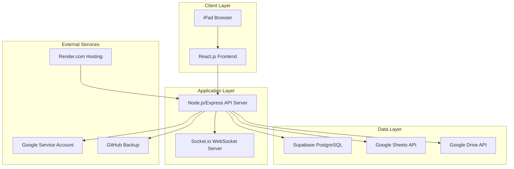

# ScaenaHub 設計書

## Overview

ScaenaHubは、中学部演劇プロジェクト用のWebコミュニケーションアプリです。Slackライクなチャット機能と演劇台本ビュー機能を持ち、完全無料で半年間運用可能な設計となっています。iPad最適化されたレスポンシブUIと、Google Services統合による効率的なデータ管理を実現します。

## Architecture

### システム全体構成



### 技術スタック

- **フロントエンド**: React.js 18 + TypeScript + Tailwind CSS
- **バックエンド**: Node.js 18 + Express.js + TypeScript
- **リアルタイム通信**: Socket.io
- **データベース**: Supabase (Primary) / Google Sheets (Fallback)
- **認証**: JWT + bcrypt
- **ファイルストレージ**: Google Drive API v3
- **デプロイ**: Render.com
- **バックアップ**: Google Drive + GitHub

## Components and Interfaces

### フロントエンド コンポーネント構成

```
src/
├── components/
│   ├── auth/
│   │   ├── LoginForm.tsx
│   │   └── RegisterForm.tsx
│   ├── chat/
│   │   ├── ChannelList.tsx
│   │   ├── MessageList.tsx
│   │   ├── MessageInput.tsx
│   │   ├── ThreadView.tsx
│   │   └── ReactionPicker.tsx
│   ├── script/
│   │   └── ScriptViewer.tsx
│   ├── admin/
│   │   ├── UserManagement.tsx
│   │   ├── ChannelManagement.tsx
│   │   ├── BackupSettings.tsx
│   │   └── SystemSettings.tsx
│   └── common/
│       ├── Layout.tsx
│       ├── Navigation.tsx
│       └── FileUpload.tsx
├── hooks/
│   ├── useSocket.ts
│   ├── useAuth.ts
│   └── useScript.ts
├── services/
│   ├── api.ts
│   ├── socket.ts
│   └── auth.ts
└── types/
    ├── user.ts
    ├── message.ts
    └── channel.ts
```

### バックエンド API 構成

```
src/
├── routes/
│   ├── auth.ts          # 認証関連API
│   ├── users.ts         # ユーザー管理API
│   ├── channels.ts      # チャンネル管理API
│   ├── messages.ts      # メッセージ管理API
│   ├── files.ts         # ファイル管理API
│   ├── script.ts        # 台本ビューAPI
│   └── admin.ts         # 管理者API
├── services/
│   ├── database.ts      # DB接続サービス
│   ├── googleDrive.ts   # Google Drive API
│   ├── googleSheets.ts  # Google Sheets API
│   ├── backup.ts        # バックアップサービス
│   └── auth.ts          # 認証サービス
├── middleware/
│   ├── auth.ts          # 認証ミドルウェア
│   ├── admin.ts         # 管理者権限チェック
│   └── validation.ts    # リクエスト検証
├── models/
│   ├── User.ts
│   ├── Channel.ts
│   ├── Message.ts
│   └── Role.ts
└── socket/
    ├── handlers/
    │   ├── message.ts
    │   ├── channel.ts
    │   └── notification.ts
    └── middleware/
        └── auth.ts
```

### 主要API エンドポイント

#### 認証API
- `POST /api/auth/login` - ログイン
- `POST /api/auth/register` - ユーザー登録（管理者キー必須）

- `POST /api/auth/logout` - ログアウト

#### チャンネル・メッセージAPI
- `GET /api/channels` - チャンネル一覧取得
- `POST /api/channels` - チャンネル作成
- `GET /api/channels/:id/messages` - メッセージ一覧取得
- `POST /api/channels/:id/messages` - メッセージ投稿
- `PUT /api/messages/:id` - メッセージ編集
- `DELETE /api/messages/:id` - メッセージ削除
- `POST /api/messages/:id/reactions` - リアクション追加

#### ファイル管理API
- `POST /api/files/upload` - ファイルアップロード
- `GET /api/files/:id` - ファイル取得
- `DELETE /api/files/:id` - ファイル削除

#### 台本ビューAPI
- `GET /api/script` - 台本データ取得

#### 管理者API
- `GET /api/admin/users` - ユーザー一覧
- `PUT /api/admin/users/:id/roles` - ユーザーロール変更（複数ロール対応）
- `GET /api/admin/roles` - ロール一覧取得
- `POST /api/admin/roles` - 新規ロール作成
- `PUT /api/admin/roles/:id` - ロール設定変更
- `PUT /api/admin/channels/:id/permissions` - チャンネル権限設定
- `POST /api/admin/backup` - 手動バックアップ実行
- `GET /api/admin/system-status` - システム状態取得

## Data Models

### User Model
```typescript
interface User {
  id: string;
  username: string;
  passwordHash: string;
  roles: string[]; // 複数ロール対応
  displayName: string;
  avatar?: string;
  isActive: boolean;
  createdAt: Date;
  updatedAt: Date;
}
```

### Channel Model
```typescript
interface Channel {
  id: string;
  name: string;
  description?: string;
  type: 'public' | 'private';
  allowedRoles: string[];
  createdBy: string;
  createdAt: Date;
  updatedAt: Date;
}
```

### Message Model
```typescript
interface Message {
  id: string;
  channelId: string;
  userId: string;
  content: string;
  type: 'text' | 'file' | 'system';
  threadId?: string;
  parentMessageId?: string;
  mentions: string[];
  reactions: Reaction[];
  attachments: Attachment[];
  isEdited: boolean;
  editedAt?: Date;
  createdAt: Date;
}

interface Reaction {
  emoji: string;
  users: string[];
  count: number;
}

interface Attachment {
  id: string;
  filename: string;
  mimeType: string;
  size: number;
  googleDriveId: string;
  url: string;
}
```

### データベース設計（Supabase）

```sql
-- Users table
CREATE TABLE users (
  id UUID PRIMARY KEY DEFAULT gen_random_uuid(),
  username VARCHAR(50) UNIQUE NOT NULL,
  password_hash VARCHAR(255) NOT NULL,
  roles TEXT[] DEFAULT ARRAY['member'], -- 複数ロール対応
  display_name VARCHAR(100) NOT NULL,
  avatar TEXT,
  is_active BOOLEAN DEFAULT true,
  created_at TIMESTAMP DEFAULT NOW(),
  updated_at TIMESTAMP DEFAULT NOW()
);

-- Roles table
CREATE TABLE roles (
  id UUID PRIMARY KEY DEFAULT gen_random_uuid(),
  name VARCHAR(50) UNIQUE NOT NULL,
  description TEXT,
  permissions JSONB DEFAULT '{}',
  created_at TIMESTAMP DEFAULT NOW(),
  updated_at TIMESTAMP DEFAULT NOW()
);

-- Channels table
CREATE TABLE channels (
  id UUID PRIMARY KEY DEFAULT gen_random_uuid(),
  name VARCHAR(100) NOT NULL,
  description TEXT,
  type VARCHAR(20) DEFAULT 'public',
  allowed_roles TEXT[],
  created_by UUID REFERENCES users(id),
  created_at TIMESTAMP DEFAULT NOW(),
  updated_at TIMESTAMP DEFAULT NOW()
);

-- Messages table
CREATE TABLE messages (
  id UUID PRIMARY KEY DEFAULT gen_random_uuid(),
  channel_id UUID REFERENCES channels(id) ON DELETE CASCADE,
  user_id UUID REFERENCES users(id),
  content TEXT NOT NULL,
  type VARCHAR(20) DEFAULT 'text',
  thread_id UUID,
  parent_message_id UUID REFERENCES messages(id),
  mentions UUID[],
  reactions JSONB DEFAULT '[]',
  attachments JSONB DEFAULT '[]',
  is_edited BOOLEAN DEFAULT false,
  edited_at TIMESTAMP,
  created_at TIMESTAMP DEFAULT NOW()
);
```

## Error Handling

### エラー分類と対応

#### 1. 認証エラー
- **401 Unauthorized**: 無効なトークン → ログイン画面にリダイレクト
- **403 Forbidden**: 権限不足 → エラーメッセージ表示
- **422 Invalid Admin Key**: 管理者キー不正 → 登録フォームでエラー表示

#### 2. データベースエラー
- **Connection Error**: DB接続失敗 → Google Sheetsにフォールバック
- **Capacity Limit**: 容量上限 → 管理者に警告通知
- **Query Error**: クエリ失敗 → ユーザーにエラーメッセージ

#### 3. Google Services エラー
- **Drive API Error**: ファイルアップロード失敗 → リトライ機構
- **Sheets API Error**: 台本取得失敗 → キャッシュデータ使用
- **Auth Error**: サービスアカウント認証失敗 → 管理者に通知

#### 4. リアルタイム通信エラー
- **Socket Disconnect**: 接続切断 → 自動再接続
- **Message Delivery Failure**: メッセージ送信失敗 → 再送機能

### エラーハンドリング実装

```typescript
// グローバルエラーハンドラー
class ErrorHandler {
  static handle(error: Error, context: string) {
    console.error(`[${context}] ${error.message}`, error);
    
    // エラー種別による処理分岐
    if (error instanceof DatabaseError) {
      return this.handleDatabaseError(error);
    }
    if (error instanceof GoogleAPIError) {
      return this.handleGoogleAPIError(error);
    }
    
    return this.handleGenericError(error);
  }
  
  static async handleDatabaseError(error: DatabaseError) {
    // Google Sheetsにフォールバック
    await DatabaseService.switchToGoogleSheets();
    NotificationService.notifyAdmin('Database fallback activated');
  }
}
```

## Testing Strategy

### テスト構成

#### 1. ユニットテスト
- **対象**: 各サービス、ユーティリティ関数
- **ツール**: Jest + Testing Library
- **カバレッジ**: 80%以上

#### 2. 統合テスト
- **対象**: API エンドポイント
- **ツール**: Supertest + Jest
- **テストDB**: テスト用Supabaseインスタンス

#### 3. E2Eテスト
- **対象**: 主要ユーザーフロー
- **ツール**: Playwright
- **環境**: ステージング環境

#### 4. パフォーマンステスト
- **対象**: 同時接続、メッセージ送信
- **ツール**: Artillery.js
- **基準**: 60人同時接続で応答時間2秒以内

### テスト実装例

```typescript
// メッセージ送信APIのテスト
describe('POST /api/channels/:id/messages', () => {
  it('should create message successfully', async () => {
    const response = await request(app)
      .post('/api/channels/test-channel/messages')
      .set('Authorization', `Bearer ${userToken}`)
      .send({
        content: 'Test message',
        mentions: ['user-id-1']
      });
    
    expect(response.status).toBe(201);
    expect(response.body.content).toBe('Test message');
    expect(response.body.mentions).toContain('user-id-1');
  });
  
  it('should handle mention notifications', async () => {
    // Socket.io通知のテスト
    const mockSocket = jest.fn();
    await MessageService.createMessage(messageData);
    expect(mockSocket).toHaveBeenCalledWith('mention', expect.any(Object));
  });
});
```

### 自動バックアップテスト

```typescript
describe('Backup Service', () => {
  it('should backup to Google Drive successfully', async () => {
    const backupResult = await BackupService.backupToGoogleDrive();
    expect(backupResult.success).toBe(true);
    expect(backupResult.fileId).toBeDefined();
  });
  
  it('should fallback to GitHub on Drive failure', async () => {
    jest.spyOn(GoogleDriveService, 'upload').mockRejectedValue(new Error());
    const backupResult = await BackupService.executeBackup();
    expect(backupResult.method).toBe('github');
  });
});
```

## セキュリティ考慮事項

### 1. 認証・認可
- JWT トークンの適切な有効期限設定（1時間）
- リフレッシュトークンによる自動更新
- 管理者キーの環境変数管理
- パスワードのbcryptハッシュ化（saltRounds: 12）

### 2. 入力検証
- 全APIエンドポイントでの入力サニタイゼーション
- XSS対策（React標準のエスケープ + DOMPurify）
- SQLインジェクション対策（パラメータ化クエリ）

### 3. ファイルアップロード
- ファイル種別制限（画像、動画、文書のみ）
- ファイルサイズ制限（10MB以下）
- ウイルススキャン（ClamAV統合検討）

### 4. レート制限
- メッセージ送信: 1分間に30回まで
- ファイルアップロード: 1分間に5回まで
- API呼び出し: 1分間に100回まで

## デプロイメント設計

### Render.com 設定

```yaml
# render.yaml
services:
  - type: web
    name: scaenahub-api
    env: node
    buildCommand: npm run build
    startCommand: npm start
    envVars:
      - key: NODE_ENV
        value: production
      - key: JWT_SECRET
        generateValue: true
      - key: ADMIN_KEY
        generateValue: true
      - key: SUPABASE_URL
        sync: false
      - key: SUPABASE_ANON_KEY
        sync: false
      - key: GOOGLE_SERVICE_ACCOUNT
        sync: false
```

### 環境変数設定

```env
# .env.example
NODE_ENV=production
PORT=3000

# Database
SUPABASE_URL=your_supabase_url
SUPABASE_ANON_KEY=your_supabase_anon_key
SUPABASE_SERVICE_ROLE_KEY=your_service_role_key

# Authentication
JWT_SECRET=your_jwt_secret
JWT_EXPIRES_IN=1h
ADMIN_KEY=your_admin_key

# Google Services
GOOGLE_SERVICE_ACCOUNT={"type":"service_account","project_id":"..."}
GOOGLE_DRIVE_FOLDER_ID=your_drive_folder_id
GOOGLE_SHEETS_ID=your_sheets_id

# Backup
GITHUB_TOKEN=your_github_token
GITHUB_REPO=username/backup-repo
BACKUP_SCHEDULE=0 2 * * *  # 毎日午前2時

# App Settings
MAX_FILE_SIZE=10485760  # 10MB
MAX_MESSAGE_LENGTH=2000
RATE_LIMIT_MESSAGES=30
RATE_LIMIT_FILES=5
```

### 自動デプロイメント

GitHub Actionsによる自動デプロイ設定：

```yaml
# .github/workflows/deploy.yml
name: Deploy to Render
on:
  push:
    branches: [main]

jobs:
  deploy:
    runs-on: ubuntu-latest
    steps:
      - uses: actions/checkout@v3
      - name: Setup Node.js
        uses: actions/setup-node@v3
        with:
          node-version: '18'
      - name: Install dependencies
        run: npm ci
      - name: Run tests
        run: npm test
      - name: Build
        run: npm run build
      - name: Deploy to Render
        uses: render-deploy/action@v1
        with:
          service-id: ${{ secrets.RENDER_SERVICE_ID }}
          api-key: ${{ secrets.RENDER_API_KEY }}
```